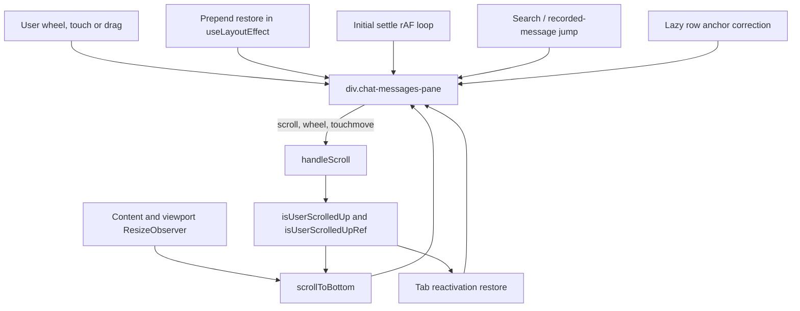
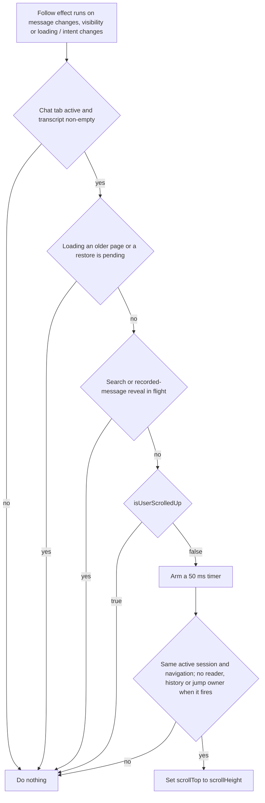
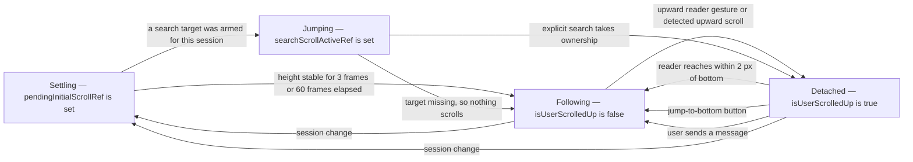
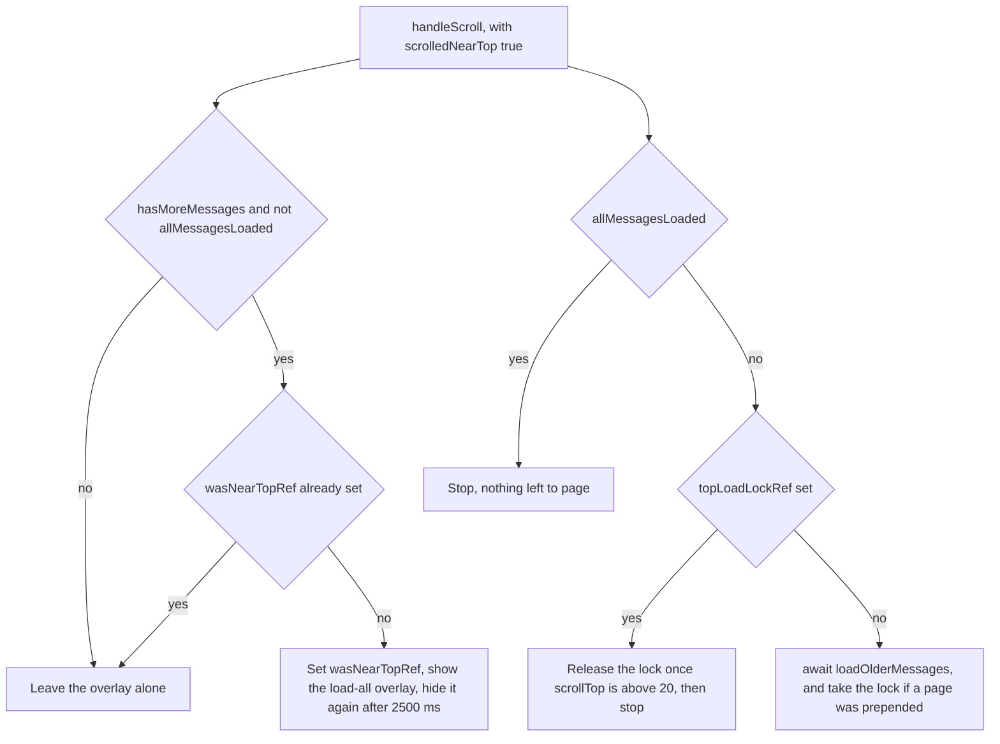

# Scrolling

*Where the transcript sits, who is allowed to move it, and the rules that stop the app from
fighting the user. Paging and row mounting are covered in
[the message store and lazy loading](./04-message-store-and-lazy-loading.md).*

## In one paragraph

The transcript is one scrolling `div`. `useChatSessionState` coordinates automatic
following, initial settling, history anchors and explicit jumps through shared refs;
`useLazyRowObserver` also corrects the visible anchor when lazy content mounts.
`isUserScrolledUp` records reader intent: `false` allows following, while `true` pauses it.
Upward wheel, touch and keyboard gestures pause immediately. Content growth alone does
not count as a reader scrolling away. Same-row streaming updates schedule a coalesced
50 ms follow, and a `ResizeObserver` follows content or viewport growth on an animation
frame. Both re-check the current session, navigation generation, reader intent and pending
history/search/reveal claims before moving the pane.

## Mental model

1. **One element owns the transcript position.** The `div.chat-messages-pane` rendered by
   `src/modules/chat/transcript/ChatMessagesPane.tsx`. A few rows contain their own capped
   scrollers (bash output, file lists, question panels) — those never move the transcript,
   and their native `scroll` events do not bubble, so they never reach `handleScroll`.
2. **The pane component holds no scroll state.** It takes `scrollContainerRef`, `onWheel`
   and `onTouchMove` as props. The main navigation thresholds and claim
   refs live in `src/modules/chat/hooks/useChatSessionState.ts`. If you are reading
   `ChatMessagesPane.tsx` looking for scroll logic, you are in the wrong file.
3. **`isUserScrolledUp` records reader intent.** Automatic follow, resize follow and tab
   reactivation use the same synchronous ref; the state also controls the jump-to-bottom
   button. A larger gap caused by new output is not itself a user gesture.
4. **Upward input pauses immediately.** A negative wheel delta, an upward-reading touch
   gesture, or `ArrowUp`/`PageUp`/`Home` on a scrollable transcript pauses following. Ordinary
   scroll events compare the old and new geometry to distinguish reader movement from
   content or viewport changes. Once detached, scrolling within 2 px of the bottom resumes
   following; the ordinary near-bottom band remains 50 px.
5. **A deferred scroll re-reads ownership at fire time.** The flag's setter updates
   `isUserScrolledUpRef` synchronously. Timers and animation frames also check session and
   navigation identity, so a callback armed for an earlier view cannot move a later one.
6. **Same-row streaming and layout growth both follow.** The follow effect depends on
   `chatMessages`, rather than just its length. It coalesces updates into one 50 ms timer
   without continually restarting the delay. A `ResizeObserver` watches `[data-chat-content]`
   and the pane itself for markdown, image, tool and viewport size changes.

7. **A claim ref suppresses the other writers.** `pendingInitialScrollRef`,
   `pendingScrollRestoreRef`, `searchScrollActiveRef`, plus two latches at the top of the
   list, `topLoadLockRef` and `wasNearTopRef`. A session change clears or re-arms all five
   in one effect.
8. **Row geometry does not change behind the user's back.** Lazy rows keep their measured
   height when their content unmounts, React keys are derived from intrinsic message fields
   rather than object identity, and `contain-intrinsic-size: auto` lets the browser
   remember each row's last rendered size.

## The pieces

| File | Role |
| --- | --- |
| `src/modules/chat/hooks/useChatSessionState.ts` | Owns the scroll position. Automatic follow and resize follow, `isNearBottom`, input ownership, history anchors and explicit jumps. |
| `src/modules/chat/transcript/ChatMessagesPane.tsx` | Renders the one scrolling element, binds the ref and the wheel/touch handlers it is handed, mounts the newest `INITIAL_MOUNTED_TAIL_ROWS` rows eagerly. |
| `src/modules/chat/ChatInterface.tsx` | Wires the hook to the pane, passes `handleScroll` as `onWheel`/`onTouchMove`, renders the jump-to-bottom button. |
| `src/modules/chat/hooks/useChatComposerState.ts` | `handleSubmit` clears `isUserScrolledUp` and scrolls to the bottom at +100 ms. |
| `src/modules/chat/transcript/LoadAllMessagesOverlay.tsx` | The "load all" pill that appears when the user reaches the top. |
| `src/modules/chat/transcript/LazyMessageRow.tsx` | Swaps a row's content for a placeholder of the same measured height, keeping an addressable wrapper. |
| `src/modules/chat/hooks/useLazyRowObserver.ts` | One `IntersectionObserver` per pane, rooted at the scroll container, `LAZY_ROW_VIEWPORT_MARGIN_PX = 1200`; preserves the visible anchor during lazy mounting. |
| `src/modules/chat/utils/searchTargetLocator.ts` | `findSearchTargetIndex` resolves a sidebar hit against loaded data; `resolveSearchWindowSize` sizes the render window. |
| `src/modules/chat/utils/messageKeys.ts` | `getIntrinsicMessageKey` — stable render keys, so a prepend does not remount the rows below it. |
| `src/index.css` | `.chat-messages-pane` / `.chat-message` containment, mobile `touch-action`, document-level overscroll containment, `.search-highlight-flash`. |
| `src/modules/project-workspace/hooks/useVisualViewportKeyboardOffset.ts` | Publishes `--keyboard-height` so the shell shrinks above the iOS keyboard. |
| `src/shared/ui/ScrollArea.tsx` | **Not used by chat.** `FileTree.tsx` and `SidebarContent.tsx` only. |
| `src/modules/chat/tests/transcriptScrollOwnership.test.tsx` | Pins deferred ownership, same-row streaming, resize following, reader gestures and cross-session jumps. |
| `src/modules/chat/tests/lazyMessageRow.test.tsx` | Pins placeholder height and the hidden-tab zero-rect case. |
| `src/modules/chat/tests/searchTargetLocator.test.ts` | Pins snippet-first resolution, the timestamp fallback and the window size. |

### Who writes `scrollTop`



The main scroll commands and their ownership checks live in `useChatSessionState.ts`.
Lazy-row anchor corrections in `useLazyRowObserver.ts` report their new geometry through
`onTranscriptLayoutScroll`, so their programmatic movement does not detach following.

## The single scroll container

**RULE: one element scrolls the transcript, and the component that renders it holds no
scroll state.**

`ChatMessagesPane` renders a single `div` with `ref={scrollContainerRef}`,
`onWheel={onWheel}`, `onTouchMove={onTouchMove}` and the classes
`chat-messages-pane relative min-h-0 flex-1 overflow-y-auto overflow-x-hidden`, then a
`max-w-[54.25rem]` inner column of rows. The export menu inside it is
`sticky right-4 top-3`, which is why it stays put while the list moves. The pane is
`memo`ised, and neither it, `MessageComponent`, nor any tool view reads or writes a scroll
offset.

Three row-level scrollers do exist — `BashCommandDisplay.tsx` (`max-h-80 overflow-auto`),
`FileListContent.tsx` and `AskUserQuestionPanel.tsx` (`max-h-48 overflow-y-auto`). They are
harmless: a native `scroll` event does not bubble, so the pane's `scroll` listener never
sees them. Their `wheel` and `touchmove` events *do* bubble to the pane; upward gestures can
pause its following when the transcript is scrollable, even before its offset changes.

`src/shared/ui/ScrollArea.tsx` is a different component with a nested inner scroller and
`touchAction: 'pan-y'`. Chat does not use it. If you are debugging chat scrolling,
`ScrollArea` is a dead end.

**Why `onWheel` and `onTouchMove` sit next to a real `scroll` listener.** They look
redundant. The comment on the `ChatMessagesPane` call site in `ChatInterface.tsx` records
why they are not: a first page is `SESSION_MESSAGES_PAGE_SIZE = 100` rows, tool results fold
into their calls, and the "load earlier" link is hidden while more pages exist — so a short
transcript can still be **not scrollable at all and never emit `scroll`**. Wheel and touch are
then the only way for the user to reach the top pager or the "load all" overlay.

## Staying at the bottom

**RULE: the user is "at the bottom" when fewer than 50 px of content sit below the fold.**

`useChatSessionState.ts` → `isNearBottom` returns
`scrollHeight - scrollTop - clientHeight < 50`, and `false` when there is no container.
`handleScroll` uses this band together with the previous `{height, top, viewportHeight}`.
It pauses on upward reader movement, but does not detach merely because new content grows
or an expanding viewport clamps the offset. `pauseBottomFollowing` cancels pending follow
and initial-settle work. The flag's setter updates state and `isUserScrolledUpRef`
synchronously, including when called by the composer. A detached reader must reach within
2 px of the bottom, press the jump button, or send a message to resume following.

**RULE: an append only scrolls when the user has not scrolled away, and it re-checks
before it moves.**



A same-row streaming flush changes `chatMessages` and schedules this follow just like a new
row. If a timer is already pending, later chunks share it; they do not postpone it.
The resize observer handles geometry that changes without new message data. It coalesces
callbacks to one animation frame and applies the same ownership checks before scrolling.

### Follow and detached



`Settling` and `Jumping` are claims held in refs, not values of the flag. Note the last
`Jumping` edge: when a jump resolves to nothing, `searchScrollActiveRef` clears but the
initial settle has already been consumed, so the transcript stays wherever it rendered with
the flag still `false`.

### Scrolling up mid-stream, and getting back

**RULE: the only ways back are explicit — scroll down, press the button, or send a
message.**

While `isUserScrolledUp` is true, `ChatInterface.tsx` renders one round `ArrowDownIcon`
button floating just above the composer, gated on `isUserScrolledUp && chatMessages.length > 0`.
There is **no unread count and no new-message indicator**; the button is the whole
affordance.

Its handler is `scrollToBottomAndReset`, not `scrollToBottom`. The difference matters: when
`allMessagesLoaded` is set (the user pulled the whole transcript in), it also drops
`visibleMessageCount` back to `INITIAL_VISIBLE_MESSAGES = 100` and clears
`allMessagesLoaded`. Jumping to the bottom throws away the widened render window on
purpose — the window only existed to reach something far up.

```mermaid
sequenceDiagram
    participant U as User
    participant P as Pane
    participant H as handleScroll
    participant W as Realtime
    participant S as Store
    participant E as FollowEffect

    U->>P: drag upward
    P->>H: scroll event
    H->>H: detect upward reader movement, pause following
    W->>S: stream_delta flush every 100 ms
    S->>E: same row rewritten, effect runs
    E->>E: reader owns the viewport, no timer armed
    W->>S: a tool_use row arrives
    S->>E: row count changed, effect runs
    E->>E: isUserScrolledUp is true, no timer armed
    U->>P: press jump-to-bottom
    P->>P: scrollToBottomAndReset sets scrollTop to scrollHeight
    P->>H: scroll event
    H->>H: bottom reached; following remains enabled
```

## Deferred scrolls re-check intent

**RULE: a scroll armed on a timer must re-read `isUserScrolledUpRef` before it moves
anything.**

| Where | Delay | Re-checks? |
| --- | --- | --- |
| Message follow effect (`useChatSessionState.ts`) | 50 ms, coalesced | yes — intent, active session, navigation generation and history/jump claims |
| Content / viewport resize (same file) | one animation frame | yes — same ownership checks plus container identity |
| External-update refresh (same file, the `externalMessageUpdate` effect) | 200 ms | yes — same guard, and only armed when `isNearBottom()` held before the refetch |
| Composer send (`useChatComposerState.ts` → `handleSubmit`) | 100 ms | **no** — it sets the flag false itself, then calls `scrollToBottom()` unconditionally |

The first two used to fire unconditionally. Commit `a1a42774` describes the failure:
scrolling up inside the delay was silently undone, and because a programmatic scroll itself
emits a `scroll` event, the resulting `handleScroll` reset `isUserScrolledUp` to false and
hid the jump-to-bottom button too. The user was returned to the bottom *and* lost the
control that would have explained why.

`transcriptScrollOwnership.test.tsx` pins both directions on fake timers, driving the real
hook against a hand-built container (jsdom has no layout, so `scrollHeight`/`clientHeight`
are stubbed and `scrollTop` writes are recorded):

- *"does not yank the view back down when the user scrolls up inside the delay"* — appends
  a row, flips the flag, advances 200 ms, asserts **zero** writes.
- *"still sticks to the bottom when the user has not scrolled away"* — same setup without
  the flip, asserts a write of `scrollHeight`.

The test stubs `requestAnimationFrame` to a no-op on purpose: the initial-settle loop is a
separate writer that would otherwise satisfy an assertion meant for the timer.

The composer send is deliberately unguarded — the user pressed Enter, so the intent is
fresh. The cost is that scrolling up within 100 ms of sending is undone.

## Reaching the top: the pager, the lock and the overlay

**RULE: the top 100 px is a trigger zone, and it fires at most once per visit.**

The second half of `handleScroll` computes `scrolledNearTop = container.scrollTop < 100`
and runs two independent latches off it.



- **`wasNearTopRef`** debounces the overlay so it appears once when the user arrives at the
  top, not on every scroll event there. It is cleared as soon as `scrolledNearTop` goes
  false. The 2500 ms hide timer in the hook is matched by the overlay's own
  `loadAllOverlayAutoFade 2500ms` animation in `LoadAllMessagesOverlay.tsx`, so the pill
  fades out exactly as the state clears.
- **`topLoadLockRef`** stops a page load from immediately triggering the next one. After a
  successful prepend the restore leaves you near the top again, which would satisfy
  `scrolledNearTop` on the very next event. The lock is only released once
  `container.scrollTop > 20` — the user must actively move away from the very top before
  another page is fetched. Note the asymmetry: entering the zone is `< 100`, leaving the
  lock is `> 20`.

`loadAllMessages` (the overlay's button) takes a different path: it fetches the whole
transcript with `limit: null`, sets `visibleMessageCount` to `Infinity`, captures a scroll
anchor first, and shows a green "all loaded" pill for 2500 ms.

## Restoring position after a prepend

**RULE: prepending rows must not move content under the user's eyes. Position is restored
from an anchor element, not from a scroll offset.**

`loadOlderMessages` calls `captureScrollRestoreState(container)` *before* the fetch. That
records four things: `scrollHeight`, `scrollTop`, an anchor element, and that anchor's
offset from the container's top edge. The anchor is the first permanent `[data-chat-row]` wrapper whose
`getBoundingClientRect()` intersects the container viewport — in plain terms,
the first row currently visible, including a placeholder.

After `sessionStore.fetchMore` reports `prependedCount > 0`, the captured state is parked in
`pendingScrollRestoreRef` and `visibleMessageCount` grows by `SESSION_MESSAGES_PAGE_SIZE`. A
`useLayoutEffect` — before paint — drains it:

| Case | Correction |
| --- | --- |
| Anchor still belongs to this container and its offset was recorded | `scrollTop += newAnchorOffset - oldAnchorOffset` |
| No anchor, or it is gone | `scrollTop = oldTop + newScrollHeight - oldHeight` |

The anchor path is the accurate one; the height-delta path is the fallback. What keeps the
anchor alive across the prepend is **stable keys**: `ChatMessagesPane` builds a
`messageKeyMap` each render from `getIntrinsicMessageKey`, disambiguated by occurrence index
on collision. Its comment states the reason — a server refresh replaces source records with
equivalent new objects, so object identity is not a durable React key across pagination or
hydration. The key falls back through `id`, `messageId`, `toolId`, `toolCallId`, `blobId`,
`rowid`, `sequence`, and only then to a timestamp-plus-content-prefix string.

The same mechanism is reused by `loadAllMessages`. While `pendingScrollRestoreRef` is set,
the append-follow effect declines outright — a prepend must never be mistaken for an
append — and the restore branch of the `useLayoutEffect` returns early, so a pending restore
also beats the tab-reactivation restore in the same commit.

## Opening a session, switching, and coming back

**RULE: each programmatic scroll stakes a claim, and every other writer checks it.**

| Trigger | Mechanism | Claim ref |
| --- | --- | --- |
| Opening a session | rAF settle loop | `pendingInitialScrollRef` |
| Returning to the Chat tab | `useLayoutEffect` reactivation branch | — |
| Older page prepended | `useLayoutEffect` restore branch | `pendingScrollRestoreRef` |
| Sidebar search hit | `scrollIntoView` retry chain | `searchScrollActiveRef` |
| Expanding a tool view | ResizeObserver follows only when no reader/jump owns the viewport | same follow guards |

### Opening a session

A single `scrollToBottom()` at +200 ms used to be enough. It is not: markdown blocks, code
highlighting and images finish rendering after that window, `scrollHeight` grows, and
nothing re-anchors — the tab opens visually "scrolled way up" with the newest assistant
message off screen. The current effect runs a `requestAnimationFrame` loop that sets
`scrollTop = scrollHeight` **every frame**, counting frames and consecutive stable heights;
it stops at **3 consecutive stable frames or 60 frames (~1 s)**, whichever comes first, and
then clears `pendingInitialScrollRef`. The loop is cancelled by the effect's own cleanup
calling `cancelAnimationFrame`; the session-change effect *re-arms*
`pendingInitialScrollRef` to `true` rather than clearing it.

It is helped by `INITIAL_MOUNTED_TAIL_ROWS = 30` in `ChatMessagesPane.tsx`: the newest 30
rows mount with real content on the first commit, so the loop measures real heights at the
bottom rather than placeholder estimates.

The loop declines for a search or recorded-message reveal, and each frame checks the
current session, navigation generation, reader intent and history restore. An upward
gesture cancels the initial claim, so settling cannot take the viewport back from a reader.

### Switching sessions

The session-change effect (keyed on `selectedProject?.projectId` and `selectedSession?.id`)
clears the pending search timer, clears `searchScrollActiveRef` and `searchTarget`, nulls
`pendingScrollRestoreRef`, clears `topLoadLockRef` and `wasNearTopRef`, re-arms
`pendingInitialScrollRef`, resets `visibleMessageCount` to `INITIAL_VISIBLE_MESSAGES`, and
sets `isUserScrolledUp` to false. Its comment records that ordering is load-bearing: the
effect that reads `__searchTargetSnippet` off the newly selected session runs *after* this
one, so a session opened *from* a search result re-arms immediately.

### Returning to the Chat tab

The workspace retains the chat tree when a covering panel, modal or hidden remote pane
makes it inactive. Tool panels can also sit beside a still-visible main chat.
`onTranscriptLayoutScroll` records `{height, top, viewportHeight}` after scrolls and anchor
corrections. The `useLayoutEffect` reactivation branch, recognised through
`wasChatActiveRef`, restores the saved top when detached or the latest bottom when following.
Hidden panes do not receive automatic follow writes.

BTW panels have their own small transcript scroller. `WorkspacePanelsProvider` retains each
main conversation's BTW selection and open state; `WorkspaceTabs` lists only that
conversation's BTW tabs. Switching away hides their content without unmounting it or aborting
requests. Returning restores the drafts and completed answers; explicitly closing the BTW
aborts its pending request. This lifetime is covered by `btwTabs.test.tsx` and is separate
from the main transcript's scroll ownership.

## Jumping to a search hit

**RULE: resolve the target in the data first; only then look for its row, and only ever by
exact timestamp until the final try.**

The sidebar (`Sidebar.tsx`, `onConversationResultClick`) puts `__searchTargetSnippet` and
`__searchTargetTimestamp` on the selected session object. The jump then:

1. Sets `searchScrollActiveRef` — the initial settle and the append-follow both stand down.
   The arming effect requires a non-empty snippet string; without one there is no jump.
2. Fetches the **entire** transcript into the store (`limit: null`) so an old hit is
   reachable, without rendering all of it.
3. Resolves the index against the loaded data, not the DOM:
   `searchTargetLocator.ts` → `findSearchTargetIndex`. The snippet is authoritative —
   normalised, ellipsis-stripped, lower-cased, `MIN_SNIPPET_LENGTH = 10`,
   `MAX_SNIPPET_LENGTH = 80`, matched against `displayText`, `content`, string `toolInput`
   and string tool-result content. **Only if the snippet misses** does the timestamp take
   over, and it returns the *nearest* message by time, not an exact match. `-1` — and
   therefore no scroll at all — happens only when the snippet misses *and* there is no
   finite timestamp. `searchTargetLocator.test.ts` pins both halves: *"a snippet that
   matches nothing reports a miss instead of guessing"* and *"the timestamp is only a
   fallback when the snippet misses"*.
4. Widens the render window with
   `resolveSearchWindowSize(count, index, SEARCH_TARGET_CONTEXT_MESSAGES = 20)`, applied as
   `Math.max(previous, required)` so the window never shrinks. `visibleMessages` is a tail
   slice, so covering index N means rendering everything after it.
5. Waits 150 ms for React to commit, then looks the row up by `data-message-timestamp` and
   calls `scrollIntoView({ block: 'center', behavior: 'smooth' })` plus a
   `search-highlight-flash` class removed after 4000 ms.

**The retry budget.** `SEARCH_SCROLL_RETRIES = 20` is the starting value of `retriesLeft`,
and there is a leading `setTimeout` before the first attempt, so the chain is **21 attempts
spaced `SEARCH_SCROLL_RETRY_DELAY_MS = 150` apart — about 3.15 s in total**. The budget is
that long because widening the window can commit thousands of rows that each run the
markdown pipeline.

**Why `allowNearest` exists.** `findRenderedMessageElement` is called with
`allowNearest = (retriesLeft === 0)`, so every attempt but the last accepts an **exact**
timestamp match only. The final attempt relaxes to nearest-by-time because a hit on the
second or later call inside a collapsed tool group has no row of its own:
`groupConsecutiveTools` stamps the group item with the **first** message's timestamp
(`toolGrouping.ts`), so the group row is the nearest match, never an exact one.

### Expanding a tool view

Nothing scrolls. There is no `scrollIntoView` anywhere under
`src/modules/chat/transcript/` or the tool renderers. Expansion is a layout change the
browser's own scroll anchoring absorbs; if the row later unmounts, `LazyMessageRow` records
the expanded height first.

## Lazy rows and height stability

**RULE: unmounting a row's content must not change the scroll geometry.**

`LazyMessageRow` wraps every transcript row in a permanent lightweight `div` carrying
`data-message-timestamp`. The expensive subtree mounts only while the row is within
`LAZY_ROW_VIEWPORT_MARGIN_PX = 1200` of the viewport, tracked by one shared
`IntersectionObserver` per pane rooted at the scroll container (`useLazyRowObserver.ts`).

Three details exist purely to protect the scroll position:

1. **Measure before unmount.** `handleNearViewportChange` reads `offsetHeight` *while the
   content is still in the DOM*, then renders the placeholder at exactly that height. A row
   you have already seen costs nothing in geometry to scroll back through.
2. **The wrapper stays addressable.** Search uses `[data-message-timestamp]` and history
   anchors use `[data-chat-row]`; both survive when the content unmounts. The shared lazy-row
   observer captures this wrapper, commits its mounting batch, restores the anchor and then
   reports the corrected geometry to the transcript owner.
3. **Zero-sized rects are ignored.** A hidden Chat tab (`display: none`) reports
   `isIntersecting: false` with a `0x0` rect. Treating that as "scrolled away" would wipe
   every row's mounted state and its measured height. `lazyMessageRow.test.tsx` pins this
   as *"ignores the zero-rect non-intersections a hidden tab reports"*.

Rows never yet measured fall back to `ESTIMATED_ROW_HEIGHT_PX = 100`. The observer restores
the visible anchor when those estimates are replaced; its correction accounts for any
anchoring the browser already applied.

CSS does a second pass of the same idea in `src/index.css`:

```css
.chat-messages-pane { contain: layout style paint; }
.chat-message { contain: layout style paint; content-visibility: auto; contain-intrinsic-size: auto 180px; }
.chat-message.assistant { contain-intrinsic-size: auto 240px; }
.chat-message.user, .chat-message.tool, .chat-message.error { contain-intrinsic-size: auto 96px; }
```

The `auto` keyword in `contain-intrinsic-size` makes the browser remember each row's last
rendered size, so skipping an off-screen row's rendering does not resize it.

The repo **never sets `overflow-anchor`**, so the browser default (`auto`) stays in effect
for everything the JS does not explicitly restore — which is what absorbs a tool card
expanding or a code block finishing highlighting.

## Mobile, keyboard and CSS

**RULE: the document never scrolls; only the pane does.**

| Rule | File | Why |
| --- | --- | --- |
| `html, body { overflow: hidden; overscroll-behavior-y: contain; }` | `src/index.css` | The shell is a `fixed inset-0` container, so the document never needs to scroll. Clipping it removes the phantom full-height scrollbar and disables mobile pull-to-refresh. |
| `* { touch-action: manipulation; }` under `max-width: 768px` | `src/index.css` | Kills the 300 ms tap delay — and would kill scrolling, which is why the next two rules exist. |
| `.overflow-y-auto { touch-action: pan-y; -webkit-overflow-scrolling: touch; }` | `src/index.css` | Re-asserts vertical panning and momentum for the pane. |
| `.chat-message { touch-action: pan-y; }` | `src/index.css` | Same, for the rows themselves. |
| `--keyboard-height` from `visualViewport.resize` | `useVisualViewportKeyboardOffset.ts` | `ProjectWorkspaceShell.tsx` applies it as `style={{ bottom: 'var(--keyboard-height, 0px)' }}`, so the fixed shell shrinks above the iOS keyboard instead of being covered by it. |
| `@media (prefers-reduced-motion: reduce) { scroll-behavior: auto !important; }` | `src/index.css` | The only `scroll-behavior` declaration in the repo. Nothing sets `smooth` in CSS. |

`scrollToBottom` is an instant `scrollTop = scrollHeight` assignment. The only smooth scroll
in the transcript is the search jump's explicit `behavior: 'smooth'`.

The pane's bottom padding switches between `pb-12 sm:pb-14` and `pb-3 sm:pb-4` depending on
`hasActivityIndicator` — the composer's floating activity/stop tab overlaps the pane, so the
padding reserves space for it. That toggle changes the pane's usable height without emitting
a scroll event.

## Gotchas and why the code looks like this

- **Same-row streaming is observable.** `chatMessages` identity, not just its length,
  drives following. Streaming finalization can also update that identity without adding a
  row. Preserve this dependency when changing the message projection.
- **Geometry changes are not reader gestures.** Content and viewport resize callbacks
  preserve following when it is active, and leave a detached reader in place. Input intent
  updates the shared ref synchronously, before a deferred resize or follow can fire.
- **Programmatic movement reports its geometry.** `onTranscriptLayoutScroll` records the
  result of automatic scrolling and lazy-row anchor corrections before their browser scroll
  event is classified. Deferred callbacks must still re-check ownership.

- **The pager's two thresholds are deliberately different.** You enter the trigger zone at
  `scrollTop < 100` but only release `topLoadLockRef` at `scrollTop > 20`. If both were 100,
  the restore after a prepend — which lands you near the top by design — would immediately
  fetch the next page, and a long session would drain in one gesture.
- **Render-window changes need anchors too.** `loadEarlierMessages` captures a restore
  anchor before increasing `visibleMessageCount` by `SESSION_MESSAGES_PAGE_SIZE`. The
  restore `useLayoutEffect` depends on the visible count as well as message identity, so
  showing already-cached rows does not rely only on browser anchoring.

- **A search jump left armed across a session change was visibly wrong twice.** The new
  session opened part-way up (the initial settle declines while a jump is pending), and then
  once the retries ran out and `allowNearest` engaged, it scrolled to an unrelated message
  in the *new* session and flashed the highlight on it.
  `transcriptScrollOwnership.test.tsx` → *"does not follow the user into the next session"*
  drives exactly that: it plants a session-B row in the container, lets the jump start
  retrying against session A, switches sessions, advances past the whole retry budget, and
  asserts zero `scrollIntoView` calls and zero `.search-highlight-flash` elements.
- **The nearest-row fallback is not laziness.** It was removed from the early attempts
  (commit `0a19ad8a`) because an uncommitted window made it scroll to an arbitrary message —
  the exact failure the rewrite was meant to remove. It survives on the final attempt only,
  because that is what maps a hit inside a collapsed tool group onto its group row.
- **The initial scroll is a loop, not a timeout.** One `scrollToBottom()` at +200 ms lost
  the race against late markdown, highlighting and image layout. The rAF loop with a
  3-stable-frame / 60-frame cap is the fix.
- **Lazy rows exist for memory, and pay for it in scroll correctness.** Commit `f537a3a9`:
  "Load all" on a long session used to commit thousands of markdown/tool subtrees at once and
  grow the tab toward a gigabyte. With the 29k-row fixture the tab now holds ~112 MB with a
  few dozen mounted rows instead of ~1 GB with seven thousand. Every geometry guarantee in
  the lazy-row components — measure-before-unmount, permanent wrapper, zero-rect filter — exists to
  make that trade invisible.
- **`content-visibility: auto` is overridden for exports.**
  `src/modules/chat/export/buildTranscriptHtml.tsx` emits
  `.chat-message { content-visibility: visible !important; contain-intrinsic-size: auto !important; }`
  with the comment "off-screen skipping is a scrolling optimisation; in a printed document it
  leaves blank pages."
- **Where `IntersectionObserver` does not exist (jsdom), every row stays mounted.**
  `useLazyRowObserver` returns `null` and `LazyMessageRow` treats that as "always mounted".
  Tests that need the lazy path install a stub observer and drive it by hand.

## If you change this, check that

| If you touch | Also check |
| --- | --- |
| The 50 px threshold in `isNearBottom` | The follow effect, the tab-reactivation branch and the jump-to-bottom button all read the same flag. |
| The `< 100` top zone or the `> 20` lock release | `topLoadLockRef` must still need an explicit move away from the top, or paging runs away. |
| `chatMessages` shape or identity | The follow and restore effects depend on message identity; same-row streaming must keep triggering them. The resize observer handles later geometry changes. |
| Anything that adds a deferred scroll | It must re-read `isUserScrolledUpRef` at fire time, or `transcriptScrollOwnership.test.tsx` should fail. |
| `getIntrinsicMessageKey` or the key map in `ChatMessagesPane` | The prepend restore needs the anchor element to survive; unstable keys remount rows and drop it to the height-delta fallback. |
| `LazyMessageRow` placeholder height, the `.chat-message` class placement, or the 1200 px observer margin | Prepend anchor scan, search-jump row lookup, and `lazyMessageRow.test.tsx`. |
| `SEARCH_SCROLL_RETRIES`, the retry delay, or `findRenderedMessageElement` | The cross-session cancellation test and `searchTargetLocator.test.ts`; `allowNearest` must stay on the final attempt only. |
| `.chat-message` containment or `content-visibility` | The export override in `buildTranscriptHtml.tsx` mirrors these declarations. |
| Session load or pagination in `useChatSessionState.ts` | `pendingScrollRestoreRef`, `pendingInitialScrollRef`, `searchScrollActiveRef`, `topLoadLockRef` and `wasNearTopRef` are all handled by the session-change effect — see [the message store](./04-message-store-and-lazy-loading.md). |
| Composer send or the activity indicator | `handleSubmit` forces `isUserScrolledUp` false and scrolls unconditionally at +100 ms; the indicator changes the pane's padding without a scroll event. |
| Tool card expand/collapse | Resize following must respect reader and recorded-message reveal ownership. Any new explicit `scrollIntoView` must participate in that ownership. |

Related: [the realtime stream](./02-realtime-stream.md) for how rows arrive.
