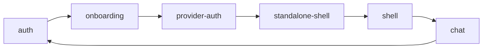

# 可维护性 cleanup 评估

评估日期：2026-09-10。代码基线：`137575485cf7838ccdba7e0b795dbc748ebdf602`，分支 `personal/cloudcli`。以下评估记录上述基线的原始情况；其后的第一批实施进度见下方。后续建议仍按风险分批进行。

最值得投入的是让“一个行为有一个明确的所有者”，并让网络协议和模块边界可以自动验证。仓库已有模块划分、严格 TypeScript 配置、较多回归测试和安全的分阶段构建，适合小步整理。

## 第一批实施进度

已实现：

- 备份八类网络结构与 provider capabilities 共用 root `shared/contracts/`；两端旧入口保留重导出，备份格式和版本保持不变。规范新增纯协议例外，架构检查限制其中只能声明类型和引用内部契约。其他 shared 归属规则没有全量迁移。
- capabilities 统一解码，保留旧远端缺省字段的未知语义，HTTP/协议错误不会被缓存成不支持。
- 队列两条忙碌路径统一返回 `RUN_IN_PROGRESS`；重试不再匹配文案。增加竞争时恢复原排队消息且只发送一次的测试。完整回执状态机统一仍留待后续切片。
- Claude 权限 helper 移入现有偏好模块，移除 Shell 对聊天模块的依赖；检查脚本阻止该依赖重新出现。
- Agent 提取有类型的响应收集器，支持 normalized 与旧消息，修复空回复、失败仍报成功以及进度事件重复；失败不进入 Git/PR 发布流程。
- 新增 PR/分支检查流程，运行类型检查、lint/架构检查、两端测试和构建；校正输入拒绝的运行状态说明。

同批修复用户新反馈：BTW 绑定主会话显示，切走保留草稿、请求和结果，切回恢复；Git/Worktrees 与文件树按当前项目目录隔离，旧请求不能覆盖或导航回旧目录，旧编辑器未保存内容继续保留。

后端运行编排解耦、Hub 分组命令集中、大型聊天生命周期重构与路由整体恢复类型检查仍属于后续切片，未在这一批混入。

验证：前端全量 891 项通过；后端全量 772 项通过、1 项跳过；两端类型检查和生产构建通过。Lint 0 error，保留基线的 212 项 warning。架构检查既验证了当前代码，也用临时坏样例验证会拒绝运行时代码、外部契约依赖和 Shell → chat 的依赖。尚未运行远端 CI 或部署此批改动。

## 原始评估证据

下列证据对应文首的评估基线；文件链接指向工作区当前版本，部分问题已由上述第一批实施修复。

统计范围为 Git 跟踪的 `src/`、`server/` 和根目录 `shared/` 中的 JS/TS 文件，排除测试后共 691 个文件、119,810 行；行数包含注释，不能直接当成复杂度。另有 232 个测试文件。

| 信号 | 当前情况 | 维护上的含义 |
| --- | --- | --- |
| 共享文件集中 | 前端 types 2,139 行，后端 types 1,629 行，前端 API 904 行 | 不同功能经常修改同一处公共入口 |
| 近期改动集中 | 最近 20 个提交中，前端 types 被改 14 次，API 和 RemoteHubApp 各 10 次，聊天 session hook 9 次 | 优先整理这些频繁变化的交界处，比单看大文件更有价值 |
| 模块循环 | 静态生产依赖图存在一个 24 文件的前端强连通分量、一个 11 文件的后端强连通分量 | 经过 index 导入仍可能形成循环；当前边界检查主要限制入口，没有限制依赖方向 |
| 类型检查缺口 | 8 个后端文件使用 `@ts-nocheck`，包括 Git、Agent、Taskmaster 和 Commands 路由 | 类型检查通过不能说明这些关键路径也受到了完整检查 |
| 检查信号 | 本轮 lint 为 0 error、212 warning；其中 effect 内 setState 87 项、refs 33 项、effect 依赖 13 项 | 应按状态语义逐项审查；告警数不等于 bug 数 |
| 自动验证 | 现有 desktop 流水线有 typecheck；仓库工作流中未看到 PR 级 lint/test 工作流 | 现有测试值得接入持续验证，减少依赖每次人工记得运行 |

依赖统计剔除了显式 type-only 导入，分析静态 import/export，不覆盖所有动态加载。本轮没有做 bundle、内存或加载速度基准，因此不据此承诺性能提升。29 个类型名同时出现在前后端 shared types 中；部分是不同用途的结构，不能全部视为可直接合并的重复定义。

## 建议顺序

| 顺序 | 整理对象 | 首个可独立交付的切片 | 收益 / 风险 |
| --- | --- | --- | --- |
| 1 | 协议与验证基线 | 为 Agent 结果协议补回归并单独修复；校正文档、接入测试 | 高收益，低风险 |
| 2 | 共享代码归属 | 调整归属规则；以备份协议和 provider capabilities 为试点 | 高收益，中低风险 |
| 3 | 队列与送达状态 | 用稳定错误码表达未接收原因；统一回执合并规则 | 高收益，中风险 |
| 4 | 模块依赖循环 | 移走 Shell 对 chat 工具函数的依赖；随后拆后端编排与广播依赖 | 高收益，前端切片低风险、后端中高风险 |
| 5 | 状态所有权 | 先集中 Hub 分组命令，再集中聊天订阅/重连/rewind 生命周期 | 高收益，需分批控制回归 |
| 6 | 大型路由和例外 | 按端点抽取业务服务，逐文件移除 `@ts-nocheck` | 中高收益，中风险 |

### 1. 先让协议说明与真实行为一致

[实时流文档](/Users/littledijkstraz/Documents/Codex/2026-09-06/self-host-local-cloudcli-self-hosted/work/cloudcli-fork/docs/architecture/02-realtime-stream.md) 仍描述 `protocol_error` 会结束运行并清除忙碌状态；[当前处理器](/Users/littledijkstraz/Documents/Codex/2026-09-06/self-host-local-cloudcli-self-hosted/work/cloudcli-fork/src/modules/chat/hooks/useChatRealtimeHandlers.ts) 则根据服务端 `isProcessing` 保留正在运行的任务。错误回执属于某一条输入，不能自动推断整个进程结束。历史加载、流式滚动的说明也有随近期修复过时的部分。

先更新这些行为约定，并把每条关键约定指向现有测试和稳定符号。重点保留：明确未接收与送达未知有区别；已送达不能倒退；旧 run 的迟到消息不能污染新 run；历史数据加载与 DOM 是否可见要分开；手动未读与自动内容观察不能互相覆盖。

两侧局部 mock 测试继续保留，再补同一批 JSON 样例的服务端产出/校验与前端消费测试。目前前后端分别通过类型检查，不能保证它们对同一个 wire 字段有一致理解。新增根目录 shared 测试时，需同时扩充[测试发现范围](/Users/littledijkstraz/Documents/Codex/2026-09-06/self-host-local-cloudcli-self-hosted/work/cloudcli-fork/package.json)。

### 2. 按所有权整理 shared，先保留兼容入口

[前端规范](/Users/littledijkstraz/Documents/Codex/2026-09-06/self-host-local-cloudcli-self-hosted/work/cloudcli-fork/.agents/skills/frontend-module-standards/SKILL.md) 要求两个文件使用的类型进入全局 shared；[API 规范](/Users/littledijkstraz/Documents/Codex/2026-09-06/self-host-local-cloudcli-self-hosted/work/cloudcli-fork/.agents/skills/frontend-module-standards/SKILL.md) 又要求所有接口进入同一 api.ts。因此 shared 文件持续增长部分是现有规则的结果。实施拆分前，应同步更新规范和 lint 边界。

建议归属规则改为：模块内部共用的结构留在所属模块；真正跨模块共用的结构按领域进入 shared；前后端共同使用的网络结构放入纯 `shared/contracts/`。UI 状态和数据库记录继续由各自模块维护。公共入口只导出已声明的 API，允许经过配置的纯契约入口。

首个试点可以是刚增加的备份：同一套网络结构现在分别位于[后端](/Users/littledijkstraz/Documents/Codex/2026-09-06/self-host-local-cloudcli-self-hosted/work/cloudcli-fork/server/shared/types.ts)和[前端](/Users/littledijkstraz/Documents/Codex/2026-09-06/self-host-local-cloudcli-self-hosted/work/cloudcli-fork/src/shared/types.ts)。抽成唯一契约后，两侧旧入口先重导出，避免同时修改所有消费者。保持备份版本、字段与导入兼容行为。

API 的另一个小切片是 capabilities：[聊天 hook](/Users/littledijkstraz/Documents/Codex/2026-09-06/self-host-local-cloudcli-self-hosted/work/cloudcli-fork/src/modules/chat/hooks/useChatProviderState.ts)与[共享 hook](/Users/littledijkstraz/Documents/Codex/2026-09-06/self-host-local-cloudcli-self-hosted/work/cloudcli-fork/src/shared/hooks/useProviderCapabilities.ts)各自请求、解码同一响应并生成 provider 索引。先提供一个明确返回解码数据的 helper，让两个消费者使用相同契约；之后逐步整理 raw Response、envelope、data 三种返回形式。保留普通、本地 Hub、远端请求各自的认证、令牌刷新、取消、超时和重定向策略。

### 3. 用类型表达队列结果，收拢回执合并规则

[队列分发](/Users/littledijkstraz/Documents/Codex/2026-09-06/self-host-local-cloudcli-self-hosted/work/cloudcli-fork/server/modules/scheduled-messages/services/scheduled-message-dispatcher.service.ts) 当前通过匹配两句英文错误文案来决定是否重新入队。改动提示文字可能改变重试行为。首个切片让内部发送结果提供稳定 `code` 和接收结果，保留现有文案供展示，重试只依赖结果字段。

回执优先级分别存在于[服务端 registry](/Users/littledijkstraz/Documents/Codex/2026-09-06/self-host-local-cloudcli-self-hosted/work/cloudcli-fork/server/modules/websocket/services/chat-run-registry.service.ts)、[会话 store](/Users/littledijkstraz/Documents/Codex/2026-09-06/self-host-local-cloudcli-self-hosted/work/cloudcli-fork/src/modules/chat/hooks/useSessionStore.ts)和[本地待发送副本](/Users/littledijkstraz/Documents/Codex/2026-09-06/self-host-local-cloudcli-self-hosted/work/cloudcli-fork/src/modules/chat/utils/pendingUserMessages.ts)。先把共同的送达状态转换抽成纯函数；运行状态、输入接收能力、单条消息送达情况仍是独立维度，不能合并成一个 busy 布尔值。

一个已确认的契约缺口是：服务端 NormalizedMessage 声明了 delivery，却靠[宽泛索引签名](/Users/littledijkstraz/Documents/Codex/2026-09-06/self-host-local-cloudcli-self-hosted/work/cloudcli-fork/server/shared/types.ts)接受 definitelyNotSubmitted；[前端](/Users/littledijkstraz/Documents/Codex/2026-09-06/self-host-local-cloudcli-self-hosted/work/cloudcli-fork/src/shared/types.ts)另行声明此字段。应在共享 wire 契约中显式描述它，并保留仅客户端使用的展示字段。

验收用例：重复/乱序回执、断线后刷新、后台任务继续运行时输入被拒绝、明确未接收保留附件、未知送达不自动重发、已经 delivered 的消息不重新变成 failed。每个语义变更单独有回归用例。

### 4. 先打断具体依赖环，再处理编排层

[Shell](/Users/littledijkstraz/Documents/Codex/2026-09-06/self-host-local-cloudcli-self-hosted/work/cloudcli-fork/src/modules/shell/Shell.tsx) 为读取 `getClaudeSettings` 导入 chat 的公共入口，而该入口又导出整个聊天 UI，形成这条静态循环：

箭头表示静态代码依赖，不是消息流。这个函数[本体](/Users/littledijkstraz/Documents/Codex/2026-09-06/self-host-local-cloudcli-self-hosted/work/cloudcli-fork/src/modules/chat/utils/chatStorage.ts)只读取共享用户偏好。将权限读取/保存归到偏好层，可以让终端权限继承摆脱聊天 UI 依赖，是低风险的首个切片。保持存储键、默认权限和旧值兼容，并运行现有 ShellPermissionInheritance、chatPermissions、userSettings 测试。

后端的循环涉及 providers、websocket、projects：[sessions 服务](/Users/littledijkstraz/Documents/Codex/2026-09-06/self-host-local-cloudcli-self-hosted/work/cloudcli-fork/server/modules/providers/services/sessions.service.ts)依赖 websocket registry 和广播；[广播构建器](/Users/littledijkstraz/Documents/Codex/2026-09-06/self-host-local-cloudcli-self-hosted/work/cloudcli-fork/server/modules/websocket/services/session-upsert-broadcast.service.ts)又依赖 providers 读取历史，以及 projects 生成显示名称。[后台队列](/Users/littledijkstraz/Documents/Codex/2026-09-06/self-host-local-cloudcli-self-hosted/work/cloudcli-fork/server/modules/scheduled-messages/services/scheduled-message-dispatcher.service.ts)也要通过 websocket 模块启动无 socket 的运行。

目标是让聊天运行编排拥有启动、接收、终止和回执；WebSocket、后台队列和外部 Agent 作为入口调用它。provider 与文件观察器通过小型注入接口报告变化，由应用组合层连接广播。逐步迁移现有 registry，保持唯一运行所有者和事件顺序。无需为此引入通用事件总线。

### 5. 让同一操作只有一个状态写入入口

Hub 的[分组读取/保存](/Users/littledijkstraz/Documents/Codex/2026-09-06/self-host-local-cloudcli-self-hosted/work/cloudcli-fork/src/modules/remote-hub/RemoteHubApp.tsx)、一次性导入、备份恢复与跨窗口广播由同一组件不同段落维护。重命名、删除、fork 还要同时更新分组、项目列表、远端列表和当前选择。维护成本来自同一操作影响多份投影。

先提取模块私有的分组控制器，集中 revision/CAS、reload、broadcast 和导入/恢复命令，再统一会话变更对各列表的投影。保留已有 pane/iframe 生命周期与分组存储格式。整理前补一个组合测试，覆盖 fork 只创建一次、分组刷新失败后只重试归属，以及多份列表最终一致。

聊天的[订阅时间、seq、run refs](/Users/littledijkstraz/Documents/Codex/2026-09-06/self-host-local-cloudcli-self-hosted/work/cloudcli-fork/src/modules/chat/ChatInterface.tsx)创建在 ChatInterface，被 session 与 realtime hook 共同读写，rewind 又由组件直接重置。应先把订阅、重连、上下文替换归到会话生命周期接口，向各 hook 暴露窄命令；之后再拆历史加载和 transcript viewport。保留现有 refresh coordinator、stream buffer 和 reconciliation 的行为。

运行/未读事件的分类也适合抽成纯函数，但 Hub 与普通 workspace 的存储和可见性规则应各自保留，远端身份仍需隔离。Hub metadata observer 不能因复用代码而改成接管会话输出的 chat.subscribe。

这是后期、回归风险较高的一批。验收必须覆盖新 run → 断线重连 → rewind → 旧事件迟到，以及隐藏页面主动加载全文、用户正在阅读历史时的流式增长。

### 6. 抽取业务服务时逐步恢复类型检查

[Git 路由](/Users/littledijkstraz/Documents/Codex/2026-09-06/self-host-local-cloudcli-self-hosted/work/cloudcli-fork/server/modules/git/git.routes.ts) 1,600 行，直接负责子进程、路径验证、状态解析、提交和分支操作；Agent、Taskmaster、Commands 路由也混合业务编排，并使用 @ts-nocheck。

按一组相关端点抽取注入依赖的业务服务，让路由负责输入和响应。先为现有行为加特征测试，再移除对应文件的 @ts-nocheck。Git 需要保护特殊文件名、未提交仓库、暂存/工作区区别、部分失败和子进程错误，不以文件变短作为唯一验收标准。

Agent 路径还存在需要单独修复的协议漂移：[ResponseCollector](/Users/littledijkstraz/Documents/Codex/2026-09-06/self-host-local-cloudcli-self-hosted/work/cloudcli-fork/server/modules/agent/agent.routes.ts)只收集旧式 JSON 字符串中的 claude-response，而当前 provider 会发送 normalized 对象；[返回结果](/Users/littledijkstraz/Documents/Codex/2026-09-06/self-host-local-cloudcli-self-hosted/work/cloudcli-fork/server/modules/agent/agent.routes.ts)直接标为 success。用注入的合成 provider 事件调用非流式处理器，正常 assistant+complete 得到空 messages，error+complete(exitCode=1) 仍得到 success:true。复现没有调用真实模型、数据库、网络或子进程。应先为它单独补回归并修正，随后提取有类型的结果收集器；不把行为修复藏进文件移动。

后续还有两个值得单独处理的生命周期问题。[Claude runtime](/Users/littledijkstraz/Documents/Codex/2026-09-06/self-host-local-cloudcli-self-hosted/work/cloudcli-fork/server/modules/providers/list/claude/claude-runtime.provider.ts) 的运行权、启动预留和权限请求保存在模块全局，但工厂接口看起来可以创建独立实例。可以先让 registry/lease 归属于工厂实例，生产保留唯一默认实例，再明确 SDK iterator 结束与 OS 子进程退出之间的关闭顺序。测试应验证实例隔离、同会话互斥、失败 abort 不丢失运行权，以及旧清理不会影响新运行。

[Auth middleware](/Users/littledijkstraz/Documents/Codex/2026-09-06/self-host-local-cloudcli-self-hosted/work/cloudcli-fork/server/modules/auth/auth.middleware.ts) 在模块导入时读取或生成 secret，[数据库首次访问](/Users/littledijkstraz/Documents/Codex/2026-09-06/self-host-local-cloudcli-self-hosted/work/cloudcli-fork/server/modules/database/connection.ts) 又会创建目录、迁移旧文件和建表。这使纯逻辑测试也需要先改变全局环境、关闭连接并阻止意外迁移。后期可将数据库初始化、迁移和 auth 构建变成入口处显式步骤，先保留 repository 的现有入口。该批要保护原 JWT secret 和迁移顺序，避免登录失效，并验证单纯导入模块不再产生文件。

## 实施与验收方式

建议先为已复现的 Agent 结果问题单独补测试并修复。第一批 cleanup 做几个可单独审阅的小改动：纠正文档并接入验证；明确共享代码归属规则；以备份契约和 capabilities 解码验证新结构；将队列重试从英文文案改为稳定结果；移走 Shell 的聊天工具依赖。上述切片完成后，再进入后端运行编排和大型聊天状态整理。

每个 PR 保持一项主要变化，兼容入口逐步退役。运行对应模块测试、双端 typecheck、构建和 lint；涉及协议时增加双端共同样例，涉及状态时验证完整事件序列。CI 先阻止新增循环、新增 @ts-nocheck 和新增高价值告警，对已有债务按模块逐步收紧。现有 212 项 warning 应分类处理，特别是 refs/effect 相关项要验证异步正确性之后再改。

衡量结果可以用这些具体标准：备份协议只维护一份；队列判断不再依赖英文文案；新功能不引入新的模块循环；目标路由逐步恢复类型检查；一次 Hub 会话变更只经过一个状态入口；完整历史加载不依赖聊天 DOM 可见性；修改消息状态有确定的跨端事件样例可验证。行数、文件数量和告警总数作为辅助指标。

原始评估未做全量端到端或性能基准，未判断某个功能可以删除，也未修改依赖版本。静态图只说明耦合，不能单独证明线上故障或 bundle 开销；Agent 结果问题则是额外进行了合成复现的具体行为缺陷。
